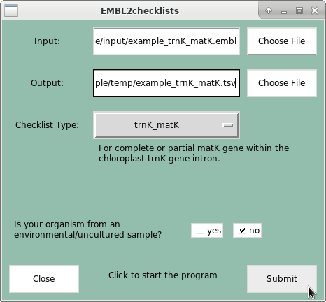

*EMBL2checklists*
=================

EMBL2checklists converts EMBL- or GenBank-formatted flatfiles to submission checklists (i.e., tab-separated spreadsheets) for submission to [ENA](http://www.ebi.ac.uk/ena) via the interactive [Webin submission system](https://www.ebi.ac.uk/ena/submit/sra/#home).


<!---

## FEATURES
* Foo
* Bar
* Baz

-->


## INPUT, OUTPUT AND PREREQUISITES
* **Input**: EMBL- or GenBank-formatted flatfile
* **Output**: tab-separated spreadsheet ("checklist")
* **Prerequisites**: Input flatfiles must have the DNA marker name (e.g., "matK", "ITS") as qualifier value for any of the defined key_features ("gene", "note", "product" or "standard_name").


## EXAMPLE USAGE
#### Commandline Interface
```
$ python2 scripts/EMBL2checklists_CMD.py \
    -i example/example_trnKmatK.embl \
    -o example/example_trnKmatK.tsv \
    -c trnK_matK \
    -e no
```
#### GUI Interface
```
$ python2 scripts/EMBL2checklists_GUI.py
```




<!---

## INSTALLATION
If you don't have Python 2.7 installed, be sure to [install it
](https://www.python.org/downloads/).

To get the most recent stable version of EMBL2checklists, run:

    $ pip install name_of_software_here

Or, alternatively, if you want to get the latest development version of EMBL2checklists, run:

    $ pip install git+https://github.com/michaelgruenstaeudl/EMBL2checklists.git


## CITATION
Using EMBL2checklists in your research? Please cite it!

- Gruenstaeudl M., Hartmaring Y. (2018). paper_title_here. journal_title_here. https://doi.org/doi_address_here

```
@article{GruenstaeudlHartmaring2018,
  doi = {...},
  url = {...},
  year  = {2018},
  publisher = {...},
  author = {Michael Gruenstaeudl, Yannick Hartmaring},
  title = {...},
  journal = {...}
}
```

-->


## CHANGELOG
See [`CHANGELOG.md`](CHANGELOG.md) for a list of recent changes to the software.
